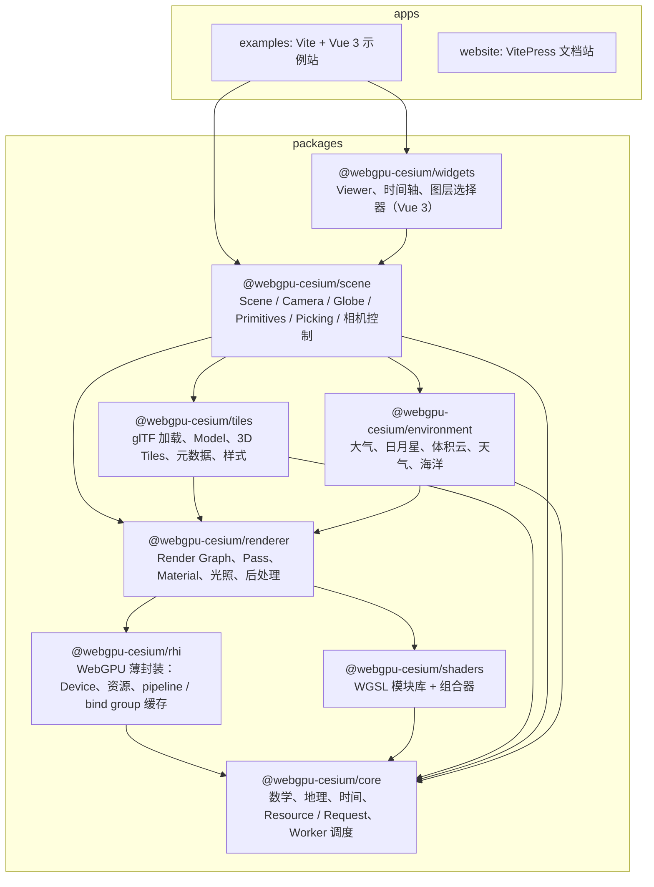
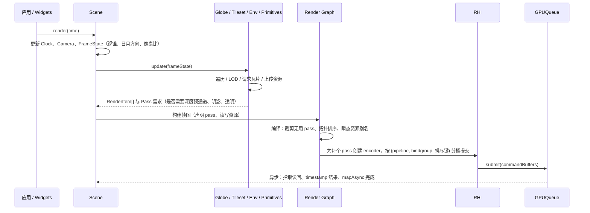
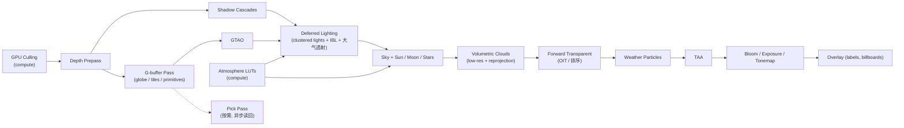

# 架构总览

## 决策

### 分层

规则：

- 依赖只能向下，禁止循环。`core` 不引用 DOM 与 GPU 类型，可在 Node 与 Worker 中运行。
- `rhi` 是唯一直接调用 `navigator.gpu` / `GPUDevice` API 的包。其他包只面对 `rhi` 的类型。
- `renderer` 不知道「地球」「瓦片」是什么，只处理 RenderItem、Pass、资源。
- `scene` 是业务编排层：管理相机、时间、图元集合，收集 RenderItem，交给 `renderer`。
- 效果类（大气、云、海洋）是 `renderer` 之上的插件式 Pass 组，而非 `renderer` 的一部分。

### 一帧的数据流

- `FrameState` 保留 Cesium 概念（帧号、时间、相机、剔除体、像素尺寸、通道开关），但去掉 `commandList` 与多视锥字段。
- RenderItem 替代 `DrawCommand`：它是**声明**（几何 + 材质变体 + 实例 buffer + 排序键 + 所属 pass 标签），不持有 GPU 状态设置逻辑；真正的 pipeline 由 `renderer` 在 pass 内解析并缓存。
- 所有 GPU→CPU 数据都异步返回（Promise），场景层不假设「本帧就能拿到」。

### 典型帧图（M6 之后的目标形态）

## 备选

- **单包大而全（对标 `@cesium/engine`）**：包边界模糊，tree-shaking 差，效果模块与核心耦合。否决。
- **Renderer 直接理解 Globe / Tiles（Cesium 现状：`Scene` 内硬编码 pass 顺序）**：新效果需要改 Scene。否决，用 Render Graph 让 pass 顺序由数据决定。
- **复用 Cesium `DrawCommand` / `RenderState` 抽象再换后端（fork 内原地迁移方案）**：WebGPU 的不可变 pipeline 与即时 `gl.enable` 模型不匹配，会产生大量适配层。被 ADR-0001 取代。

## 风险

- 分包过细会让早期迭代频繁跨包改动。缓解：M0–M3 期间允许 `scene`、`renderer`、`rhi` 在同一 PR 内改，但保持目录边界。
- Render Graph 每帧重建的 CPU 开销。缓解：pass 声明缓存 + 只在 pass 集合变化时重新编译。
- `core` 不引用 DOM 与 `Resource` 中的 `Image` / `fetch` 使用冲突。缓解：`Resource` 的图片解码走可注入的 loader；Node 下用 `fetch` 与 `ImageBitmap` polyfill 或跳过。

## 待验证

- [x] M0：最小 Render Graph 已落地（2026-09-13）：`renderer/src/graph/RenderGraph.ts` 约 530 行 + `types.ts` 约 85 行（含注释），提供 `addPass / importTexture / createTexture / compile / execute / reset`，编译做未读 pass 裁剪 + 依赖拓扑排序，执行创建单个 `GPUCommandEncoder`；每帧重建一次（Hello Triangle 单 pass）CPU 开销在 Performance 面板中不可见（< 0.1 ms）。多 pass 下的每帧重建成本与「稳定 pass + 动态 RenderItem」策略留 M2 验证。
- [x] M2：采用「稳定 pass + 动态 RenderItem」（2026-09-13）：每帧重建 graph，pass 集合固定为 `globe`（写 canvas + Reverse-Z 深度），绘制列表由四叉树当帧给出。未做编译结果缓存；单 pass 下重建成本可忽略（示例站 CPU ≈ 1 ms）。
- [ ] M4：Env 作为插件 pass 组注入帧图的接口是否够用（需要读 G-buffer 深度、写 HDR 颜色）。
