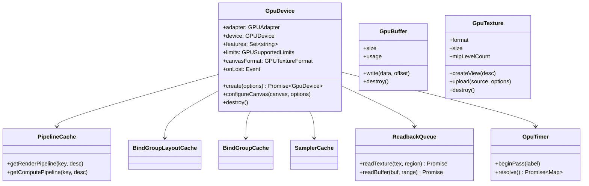
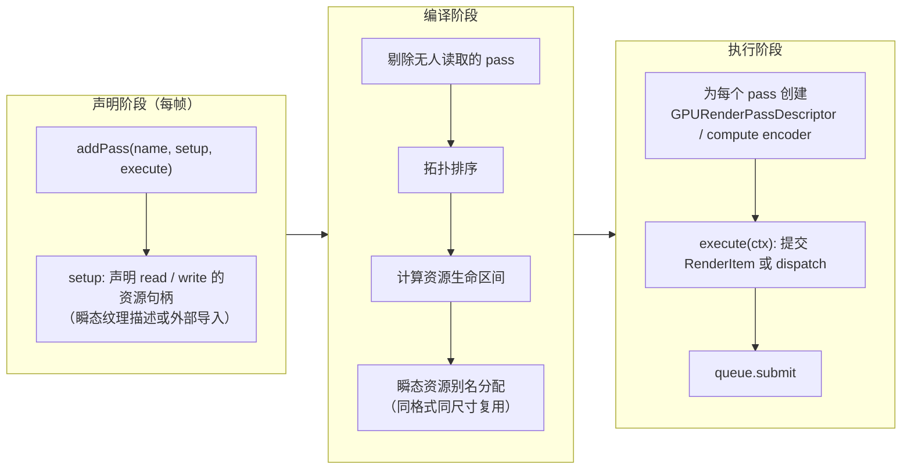

# RHI 与 Render Graph

## 决策

### 1. RHI：对 WebGPU 的薄封装

RHI 的目标不是抽象掉 WebGPU（不会再有第二个后端），而是：

1. 统一资源生命周期与调试标签；
2. 缓存所有「创建即不可变」的对象（pipeline、bind group layout、sampler、bind group）；
3. 封装异步读回、时间戳与错误处理；
4. 提供能力探测结果给上层做变体选择。

关键约定：

- **设备初始化异步且只做一次**。`Scene` 的构造需要 `GpuDevice` 实例：`const device = await GpuDevice.create(); new Scene({ canvas, device })`。不在 `Scene` 内部 `await`。
- **设备描述符保守**：默认只请求 `requiredFeatures` 中确认存在的 feature（探测后按需加入 `timestamp-query`、`shader-f16`、`indirect-first-instance`、`depth-clip-control`、`float32-filterable`、`texture-compression-bc/etc2/astc`、`subgroups`）。缺失时上层走回退变体，见 [20-tech-stack/02](../20-tech-stack/02-webgpu-capability-matrix.md)。
- **纹理上传**：`copyExternalImageToTexture` 用于 `ImageBitmap` / `HTMLCanvasElement` / `VideoFrame`；`writeTexture` 用于 typed array；压缩纹理（KTX2 → BC / ETC2 / ASTC）由 Worker 转码后 `writeTexture`。`flipY` 通过 `copyExternalImageToTexture` 的 `flipY` 选项显式传递，默认 `false`（与 Cesium 默认 `true` 相反，移植时在 imagery 上传处显式处理）。
- **Uniform 数据**：帧级、pass 级 uniform 用一个大的环形 `GPUBuffer`（`UNIFORM | COPY_DST`）+ 动态偏移（`hasDynamicOffset`），每帧 `writeBuffer` 一次；对象级数据用 storage buffer 数组按实例索引读取。不为每个对象创建 uniform buffer。
- **Bind group 缓存键**：layout id + 所有 binding 的资源 id / 偏移 / 大小。资源销毁时失效其相关 bind group。
- **Pipeline 缓存键**：shader 变体哈希（组合器输出的规范化源码哈希 + override 值）、顶点布局、图元拓扑、cull / 深度 / 模板 / blend 状态、颜色目标格式列表、深度格式、多重采样数。
- **错误**：用 `device.pushErrorScope` 包裹资源创建（开发模式）；`device.lost` 触发 `onLost` 事件，`Scene` 停止渲染并暴露给应用决定是否重建。不做自动重建。
- **标签**：所有 GPU 对象都有 `label`，格式 `包名/类名/实例标识`，方便浏览器 GPU 调试器。

### 2. Render Graph

- **资源句柄**是编译前的逻辑 ID；执行时才解析成真实 `GPUTextureView` / `GPUBuffer`。
- **瞬态资源**（G-buffer、HDR 颜色、AO、阴影级联、云的低分辨率缓冲）由帧图分配并跨帧复用池化对象；**外部资源**（canvas 当前纹理、历史帧 TAA 缓冲、地形纹理）显式导入。
- **Pass 类型**：`RenderPass`（有颜色 / 深度附件）、`ComputePass`、`CopyPass`（`copyTextureToTexture` 等）、`ReadbackPass`（写入 staging）。
- **RenderItem 提交**：`RenderPass.execute` 收到本 pass 标签下的 RenderItem 列表，按排序键（pipeline id → material bind group → 距离）排序后循环：`setPipeline` 仅在变化时调用，`setBindGroup(0/1)` 每 pass 一次，`setBindGroup(2)` 材质变化时，`setBindGroup(3)` 或动态偏移每对象。
- **Pass 顺序稳定性**：帧图结构在同一场景配置下几乎不变；对声明结果做哈希，未变化则复用上次编译结果，只更新 RenderItem 列表与外部资源。
- **调试**：帧图可导出为 Mermaid / JSON；每个 pass 自动包上 timestamp 查询（feature 可用时）并在性能面板显示。

### 3. 与 Cesium 渲染模型的映射

| Cesium | 本项目 |
| --- | --- |
| `Context` | `GpuDevice` + 缓存 |
| `DrawCommand` | `RenderItem`（声明）+ pass 内解析 pipeline |
| `RenderState`（即时 `gl.enable`） | pipeline 描述的一部分（不可变）+ pass 状态（viewport、scissor、blend constant、stencil reference） |
| `ShaderProgram` / `ShaderSource` / `ShaderBuilder` | `shaders` 组合器输出 + `GPUShaderModule` 缓存 |
| `AutomaticUniforms`（91 个 `czm_*`） | group 0 帧级 uniform 结构体 `FrameUniforms`（相机、时间、日月方向、视口）+ group 1 pass 级 |
| `uniformMap` 闭包 | 材质参数对象 → 材质 uniform / storage buffer 布局（由反射生成） |
| `Framebuffer` / `FramebufferManager` | Render Graph 瞬态纹理 + `GPURenderPassDescriptor` |
| `ComputeCommand`（全屏四边形 GPGPU） | `ComputePass` |
| `Pass` 枚举（ENVIRONMENT、GLOBE、OPAQUE、TRANSLUCENT、OVERLAY…） | 帧图中的命名 pass；RenderItem 携带 pass 标签 |
| `PickFramebuffer` + 同步 `readPixels` | `PickPass` + `ReadbackQueue`，返回 Promise |
| `FrustumCommands` 多视锥 | 删除（Reverse-Z 单视锥，见 [05](05-scene-camera-precision.md)） |

## 备选

- **立即模式（Cesium 现状）**：Scene 硬编码 pass 顺序，效果扩展要改 Scene。否决。
- **完整的「自动屏障」式帧图（Vulkan 风格）**：WebGPU 由驱动管理同步，不需要显式屏障；只保留排序、裁剪、别名三项功能，避免过度设计。
- **每对象一个 uniform buffer + bind group**：对象数上万时创建成本与内存碎片高。改用 storage buffer 数组 + 实例索引，或动态偏移。
- **不做 pipeline 缓存，依赖浏览器内部缓存**：浏览器缓存的是编译后的模块，但 `createRenderPipeline` 仍有可观开销且可能阻塞；必须在 JS 层缓存并尽量用 `createRenderPipelineAsync` 预热。

## 风险

- Pipeline 数量爆炸：材质 × 顶点格式 × pass 类型 × 变体。缓解：顶点格式标准化（见 [07](07-3dtiles-and-model.md)），变体用 `override` 而非源码分叉，统计并在性能面板展示 pipeline 数。
- `createRenderPipelineAsync` 首帧卡顿：对可预期的变体在加载时预热；未预热的变体首帧用占位材质。
- 大量 `writeBuffer` 的 CPU 拷贝：帧级 / 对象级数据汇总到少数大 buffer；地形与瓦片顶点数据一次上传。
- 设备丢失：场景需要能报告并停止；资源重建策略后置。

## 待验证

- [x] M0（部分）：`PipelineCache` 键成本已粗测（2026-09-13，`rhi/src/caches/stableKey.test.ts`，Node 22 桌面）：典型 render pipeline 描述 → 稳定 JSON 键约 **6.7 µs / 次**，键长约 440 字符；GPU 对象（layout / module）用 `WeakMap` 分配递增 id 参与键，不做深遍历。结论：每帧对几百个 RenderItem 直接算键仍在 1–2 ms 量级，M2 起 RenderItem 应持有已解析的 `pipelineKey`（只在描述变化时重算），不要每帧重算。几百个 RenderItem 的排序与提交尚未测（M0 只有 1 个）→ 转入 M2 待验证。
- [ ] M2：动态偏移 uniform 与 storage 实例数组两种对象数据传递方式的性能对比，选一种作为默认。
- [ ] M2：几百个 RenderItem 的排序 + pipeline 键查找 + 提交是否低于 1 ms（从 M0 顺延）。
- [ ] M3：瞬态资源别名在分辨率变化（窗口缩放、像素比）时的重建策略。
- [ ] M4：timestamp-query 在主流 GPU 上的精度与开销，是否默认开启。
