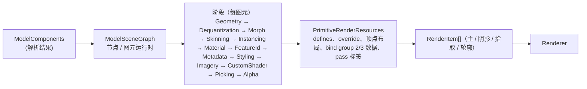

# 3D Tiles 与 Model（glTF）

## 决策

### 1. 保留的 Cesium 逻辑（移植）

| 领域 | 模块 |
| --- | --- |
| glTF 解析 | `Scene/GltfPipeline/*`（`ForEach`、`addDefaults`、`updateVersion`、`removeExtension`…）、`GltfLoader`、`GltfJsonLoader`、`GltfBufferViewLoader`、`GltfVertexBufferLoader`、`GltfIndexBufferLoader`、`GltfTextureLoader`、`GltfImageLoader`、`GltfDracoLoader`、`GltfStructuralMetadataLoader`、`ResourceCache`、`ModelComponents` 数据结构 |
| 传统格式 | `B3dmLoader`、`I3dmLoader`、`PntsLoader`、`Composite3DTileContent`、`preprocess3DTileContent`（把 b3dm / i3dm / pnts 转成 `ModelComponents`） |
| 3D Tiles 数据集 | `Cesium3DTileset`（加载、`tileset.json` 解析、根瓦片、`extras`、`asset`、统计、缓存 `Cesium3DTilesetCache`、内存管理 `maximumCacheOverflowBytes`）、`Cesium3DTile`（边界体 `TileBoundingRegion / Sphere / OrientedBoundingBox / S2Cell`、几何误差、`refine`、内容状态机、`expire`）、`Cesium3DTileContentFactory` |
| 遍历 | `Cesium3DTilesetTraversal`、`Cesium3DTilesetBaseTraversal`、`Cesium3DTilesetSkipTraversal`、`Cesium3DTilesetMostDetailedTraversal`、`Cesium3DTileOptimizations`（子边界体并集）、SSE 与 `dynamicScreenSpaceError`、`foveatedScreenSpaceError`、`preloadWhenHidden` / `preloadFlightDestinations`、`skipLevelOfDetail` |
| 隐式瓦片 | `ImplicitTileset`、`ImplicitSubtree`、`ImplicitSubtreeCache`、`ImplicitAvailabilityBitstream`、`ImplicitTileCoordinates`、`ImplicitSubdivisionScheme`、`Implicit3DTileContent`、`MortonOrder`、`HilbertOrder`、`S2Cell` |
| 元数据 | `MetadataSchema`、`MetadataClass`、`MetadataClassProperty`、`MetadataTable`、`MetadataTableProperty`、`MetadataEnum`、`MetadataEntity`、`MetadataSemantic`、`StructuralMetadata`、`PropertyTexture` / `PropertyAttribute`、`TilesetMetadata` / `TileMetadata` / `GroupMetadata` / `ContentMetadata`、`MetadataPicking` |
| 样式 | `Cesium3DTileStyle`、`Cesium3DTileStyleEngine`、`Expression`、`ConditionsExpression`、`Cesium3DTileColorBlendMode` |
| 要素 | `Cesium3DTileFeature`、`Cesium3DTilePointFeature`、`Cesium3DTileFeatureTable`、`Cesium3DTileBatchTable`（作为数据表）、`ModelFeature`、`ModelFeatureTable` |
| 其他内容类型 | `Tileset3DTileContent`（外部 tileset）、`Multiple3DTileContent`、`Empty3DTileContent`、`Vector3DTileContent`（后置）、`Geometry3DTileContent`（后置）、`GaussianSplat3DTileContent`（后置，compute 排序有机会做得更好） |
| 服务 | `createGooglePhotorealistic3DTileset`、`IonResource`、ITwin（后置）、I3S（后置） |
| Worker | `decodeDraco`、`transcodeKTX2`、`gaussianSplatSorter`（后置） |

### 2. 重写的部分：Model 渲染管线

M5 落地（2026-09-14）：未建约 35 个 `*PipelineStage` 类。`GltfLoader` 做数据准备，`GpuMeshPrimitive` 复用 M4 `materials/mesh.wgsl` + group 0/1/2/3 写 G-buffer。`BLEND` / `transmission > 0` 图元跳过（无前向透明 pass）。隐式瓦片有坐标 / Morton，无 subtree 展开。`pnts` 只解析不画。

Cesium 的 `Model` 用一串「管线阶段」（`*PipelineStage`）动态拼装 GLSL 与 uniform，最后产出 `ModelDrawCommand`。本项目保留「阶段」概念作为**数据准备**，但着色器不再由阶段字符串拼接，而是由阶段设置 **defines / override / 绑定**，最终交给组合器：

- 每个阶段是纯函数 `(components, renderResources, frameContext) => void`，只写 `renderResources`。
- 顶点布局标准化到 [04 Shader 系统](04-shader-system.md) 的固定属性位置；缺失属性用 `override` / defines 关掉对应代码，不做「零 buffer」占位。
- 量化属性（`KHR_mesh_quantization`）保留量化 buffer，WGSL 端解码（对齐 `DequantizationPipelineStage`）。
- 蒙皮：关节矩阵放 storage buffer；变形目标：目标数据放 storage buffer 按顶点索引读取（Cesium 用属性，受属性数限制；storage 方案无上限）。
- 实例化（`EXT_mesh_gpu_instancing`）：实例变换放 storage buffer，`instance_index` 索引；相机相对由实例矩阵 + 节点矩阵在 CPU 合成为 f32 前先减相机（f64）。
- 材质：glTF 材质在 `MaterialPipelineStage` 中映射为 three.js 风格的 `MeshPhysicalMaterial`（`KHR_materials_unlit` → `MeshBasicMaterial`），扩展 `KHR_materials_clearcoat / ior / specular / sheen / transmission / volume / iridescence / anisotropy / dispersion / emissive_strength`、`KHR_materials_pbrSpecularGlossiness`（转换）、`KHR_texture_transform`（→ `Texture.offset/repeat/rotation`）、`KHR_texture_basisu`、`EXT_texture_webp`；映射表与覆写钩子（`model.material`、`tileset.materialOverride`）见 [12-material-system.md](12-material-system.md) 第 5 节。不透明材质写 G-buffer；`BLEND` 与 `transmission > 0` 走前向透明 pass。
- 要素 ID 与样式：要素 ID 属性 / 纹理 → 查 storage 表得到样式颜色 / show；样式在 CPU 评估后写表（对齐 `CPUStylingPipelineStage`），GPU 只查表。
- 元数据拾取：属性纹理与属性表按需在拾取 pass 输出。
- 轮廓（`CESIUM_primitive_outline`）：保留 `PrimitiveOutlineGenerator` 生成的边坐标属性。
- `ModelImagery`（把地形影像贴到 3D Tiles 上）：后置，与 Globe 影像图集共享采样路径。

### 3. 3D Tiles 的渲染接口

- `Cesium3DTileset.update(frameState)`：遍历 → 请求 / 卸载 → 每个选中瓦片的 `content.update()` → 收集 RenderItem。遍历逻辑不改。
- 瓦片内容 `Model3DTileContent` 持有 `Model`；`Model` 输出 RenderItem 并附带 `tilesetId` / `tileId` 用于 GPU-driven 与统计。
- 内存统计（`Cesium3DTilesetStatistics`）从 RHI 的资源大小统计获得。
- 分类（`ClassificationType`、`Cesium3DTileset.classificationType`）与裁剪平面 / 多边形：M6 之后实现（依赖模板与深度技巧）。
- 点云：`pointCloudShading`（衰减、EDL）对齐 Cesium 的实现，EDL 作为后处理阶段。

### 4. GPU-driven 遍历（M8 展望）

- 第一步：CPU 遍历不变，但选中瓦片的**图元级**剔除（视锥 + Hi-Z 遮挡）在 compute 中做，输出 indirect 参数；模型合批到共享顶点 / 索引池以减少 `setVertexBuffer`。
- 第二步：瓦片边界体上传 GPU，隐式瓦片的可用性位流可直接在 GPU 遍历（八叉树 / 四叉树遍历 compute），CPU 只处理请求调度。这是研究项，不在承诺范围。

## 备选

- **完全丢弃 `*PipelineStage`，为每类模型写固定着色器**：对 glTF 这样组合爆炸的输入不可行。保留阶段模式但只做数据准备。
- **运行时字符串拼接 WGSL（对齐 Cesium `ShaderBuilder`）**：与组合器双轨，难以缓存与反射。否决。
- **b3dm / i3dm / pnts 用独立渲染路径**：Cesium 已统一到 `ModelComponents`；沿用。

## 风险

- glTF 解析层与 `ResourceCache` 依赖 Cesium 的 `Resource` / `Request` 调度细节，移植量大（约 40 文件）。这是 M5 的主要工作。
- 材质变体数量：PBR 扩展 × 纹理有无 × 顶点属性有无。缓解：材质纹理槽位固定，缺失纹理用 1×1 默认纹理绑定（避免条件编译爆炸），只有「结构性」差异（蒙皮、变形、实例、要素 ID 来源、有无某类纹理）做条件编译；策略与 [12-material-system.md](12-material-system.md) 第 4 节一致。
- `Cesium3DTileStyle` 表达式引擎（`Expression` 用 jsep 解析）与 GPU 样式（Cesium 尝试过 GPU 样式后放弃）；沿用 CPU 评估 + 表查询。
- 透明 3D Tiles 排序与 OIT：WebGPU 无 `dual-source-blending` 保证（可选 feature），OIT 方案在 M6 决定。

## 待验证

- [x] M5：默认 1×1 纹理 + `HAS_MAP` / `HAS_NORMAL_MAP` defines（2026-09-14）：与 M4 Mesh 相同，本地四盒 tileset / 三模型示例各 1 条 mesh pipeline，城市级 tileset 的 pipeline 数与带宽未测。
- [x] M5：变形目标未走 storage（2026-09-14）：只渲染 bind pose；未做属性 vs storage 对比。
- [x] M5：Draco 未接线（2026-09-14）：遇 `KHR_draco_mesh_compression` 抛错；无 Worker `writeBuffer` 路径。
- [ ] M8：合批到共享顶点池对流式加载 / 卸载的内存碎片处理。
