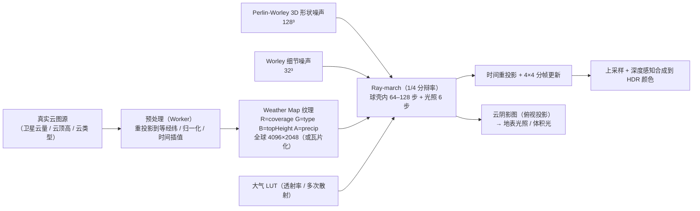

# 体积云、天气与海洋

对应 ADR-0009（云图数据源，状态：提议）。

## 决策

### 1. 体积云：ray-march + 全球 weather map

算法基线：Schneider（Nubis, SIGGRAPH 2015 / 2017 / 2022）风格的分层体积云，参考 fork 中 `ThreeGeospatial/Clouds`（takram 的 three-geospatial 移植，含 Perlin-Worley 形状、细节噪声、STBN 蓝噪声、级联阴影、时间重投影）作为实现对照。

- **云层几何**：球壳（椭球壳）而非平面板，底高 / 厚度按云类型（层云 0.5–2 km、积云 1–4 km、卷云 6–12 km）由 weather map 类型通道驱动；支持 2–3 层独立球壳。
- **Weather map 通道**：R = 覆盖率（来自真实云图）、G = 云类型 / 垂直形态（由云顶高与光学厚度推断）、B = 云顶高度归一化、A = 降水概率（用于天气系统）。
- **真实云图数据源**（候选，ADR-0009 决定）：
  1. NASA GIBS：MODIS / VIIRS `Cloud_Fraction`、`Cloud_Top_Height`、`Cloud_Optical_Thickness` 日产品，WMTS 瓦片，全球等经纬，免费；分辩率 ~ 5–10 km；每日更新（非实时）。
  2. 地球静止卫星合成（GOES-16/18 + Himawari-9 + Meteosat）：约 10–15 分钟更新，但需要自建合成服务或第三方源；分辩率 2–4 km。
  3. OpenWeatherMap / RainViewer 云层瓦片：实时、简单，但是渲染好的 RGBA 图，无物理量，需要反推覆盖率。
  4. 离线快照：内置一张压缩后的全球云量图作为默认（无网络时）。
  - 数据通过 `WeatherMapProvider` 接口抽象（`requestWeatherMap(time) -> ImageBitmap | Float32Array`），与 `ImageryProvider` 类似，可自定义。
- **预处理**：Worker 内把源瓦片拼成等经纬全球图，平滑 + 阈值，加入低频噪声破坏卫星像素块感；两帧时间数据线性插值实现云图随时间演化；再叠加小尺度程序化噪声位移模拟风。
- **渲染**：1/4 分辩率 ray-march（或 1/2 在高端），每帧只更新 1/16 像素（4×4 Bayer），其余用运动向量重投影；深度感知上采样后与场景合成。云在地形 / 建筑后面的遮挡由主深度 Reverse-Z 决定；云在大气中的空气透视由 Aerial Perspective 叠加。
- **光照**：太阳光 6 步二次 march + Beer-Powder 近似 + 多次散射近似（Wrenninge / Hillaire 的多八度）；环境光从 Multiple Scattering LUT 取；夜间月光作为第二光源。
- **云阴影**：从太阳方向渲染云层透射率到 2D 阴影图（俯视投影，覆盖相机周围 ~ 200 km），延迟光照与地形光照采样，实现「云影在地面移动」；fork 中 `CascadedShadowMaps.js`（云的级联）可参考。
- **质量预设**：`low / medium / high / ultra` 控制分辩率、步数、层数、是否云阴影，对齐 fork 的 `CloudsQualityPresets`。
- **相机在云内 / 云上**：球壳求交处理相机在壳内的情形；轨道视角时切换到「远距离模式」（降低步数、只算覆盖率与光照近似）。

### 2. 天气系统

| 效果 | 实现 |
| --- | --- |
| 雨 / 雪粒子 | compute 更新的 GPU 粒子（相机周围盒体，环绕重生），拉伸四边形（雨）/ 旋转片（雪），与深度缓冲做软遮挡；粒子密度由 weather map 降水通道与用户参数决定 |
| 雨的屏幕效果 | 屏幕空间雨滴 / 镜头水膜（可选） |
| 地表湿润 | 延迟光照阶段按湿润度调整 G-buffer 粗糙度与基础色变暗，水坑用噪声掩码 + 平面反射（SSR） |
| 雾 | 高度雾（指数）+ 距离雾，与 Aerial Perspective 统一在同一函数中叠加；体积雾（视锥体纹理 + 光照）作为可选高级项 |
| 闪电 | 随机触发的点光 / 方向光脉冲 + 云内自发光注入（在 ray-march 中加发光项）+ 屏幕闪光；雷声不在范围 |
| 风 | 全局风向 / 风速参数驱动云位移、粒子漂移、海面波向 |
| 温度 / 季节 | 后置；仅暴露参数 |

天气由 `WeatherSystem` 统一管理状态（`WeatherState`：降水强度、类型、湿润度、雾密度、风、云覆盖率偏移），可手动设置或由 `WeatherProvider` 从真实气象数据（如 Open-Meteo）拉取当前位置天气。

### 3. 海洋

- 基线：Tessendorf FFT 海面（fork 中 `Extension/Ocean/Simulation` 有 GLSL 版可对照）。WebGPU 用 compute 做 JONSWAP / Phillips 频谱初始化、时间演化、逆 FFT（256² 或 512²，2–3 个级联尺度），输出位移 / 法线 / 泡沫（雅可比）纹理。
- 几何：以 Globe 的水面掩码（`waterMask`）标记的区域为海洋，地形瓦片在水面处采样位移（顶点位移 + 法线）；近处可用屏幕空间投影网格（projected grid）提供更高细节；远处退化为法线贴图。
- 着色：菲涅尔 + 天空 / 环境反射（SSR + IBL）+ 折射（G-buffer 颜色 + 深度差衰减）+ 次表面散射近似 + 泡沫；与大气透射一致。
- 岸线：深度差做浪花与透明度渐变。
- 风：与天气系统共享风参数决定波高与波向。

## 备选

- **2D 云层 billboard / 云图贴图（Cesium `CloudCollection`）**：成本低但无体积感，不满足视觉目标。可保留为 `low` 预设下的退化。
- **纯程序化 weather map（无真实云图）**：作为无网络 / 无数据时的默认与离线模式，不是主路线。
- **Gerstner 波海洋**：比 FFT 便宜但细节差。可作为 `low` 预设。
- **体积雾用 froxel 全套（UE 风格）**：成本高，先做解析雾，froxel 作为高级可选。

## 风险

- 真实云图分辩率（5–10 km）远低于渲染视角需要的细节；必须叠加程序噪声，否则近看是像素块。
- 数据源可用性与 CORS：GIBS 支持 CORS；实时静止卫星数据需要自建服务。ADR-0009 需决定是否提供官方代理。
- 云 ray-march 在 1080p 集显上的成本可能超过 4 ms；重投影 + 分帧是必需项，不是可选。
- 云 / 透明物 / 粒子之间的排序与合成顺序（云在半透明建筑后面）。
- 海洋位移与地形瓦片 LOD 边界的接缝。

## 待验证

- [ ] M7 前：GIBS `Cloud_Fraction` 瓦片拼接为 4096×2048 等经纬图的 Worker 成本与体积；一天一张还是多张插值。
- [ ] M7：1/4 分辩率 + 4×4 分帧在中端笔记本上的成本与鬼影程度。
- [ ] M7：云阴影图覆盖范围与分辩率（200 km / 2048²）是否足够。
- [ ] M7：FFT 256² × 3 级联 compute 成本；`shader-f16` 是否可用于 FFT 中间数据。
