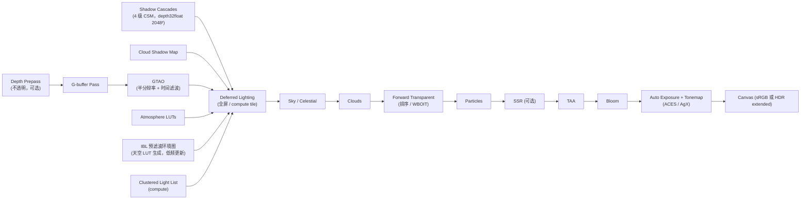

# 光照、阴影与后处理

## 决策

### 1. 渲染路径：延迟为主，前向为辅

**G-buffer 布局（`rgba8unorm` 为主，尽量紧凑）**：

| 附件 | 格式 | 内容 |
| --- | --- | --- |
| GB0 | `rgba8unorm` | 基础色 RGB + 材质 ID（terrain / model / primitive / water / cloud-occluder） |
| GB1 | `rg16float` 或 `rgba8unorm` | 八面体编码法线 |
| GB2 | `rgba8unorm` | 粗糙度、金属度、AO（材质自带）、湿润度 |
| GB3 | `rgba8unorm`（可选） | 自发光 / 清漆 / 各向异性等扩展 |
| Velocity | `rg16float` | 运动向量（TAA、云重投影） |
| Depth | `depth32float` | Reverse-Z |

- 不透明的 Globe、Model、3D Tiles、Polygon、点云写 G-buffer；透明与粒子走前向 pass 并采样光照函数（同一 WGSL 模块，保持一致）。
- fork 中 `GBuffer/*`、`Lighting/DeferredLightingStage.js` 是延迟光照在 Cesium 上的实验，可作为参数与法线编码参考。

### 2. 光照模型

- **BRDF**：Cook-Torrance，GGX 法线分布，Smith 几何项（高度相关），Schlick 菲涅尔；多次散射能量补偿（Fdez-Agüera）；清漆、各向异性作为可选项。
- **光源**：主方向光（太阳，颜色由大气透射率 LUT）、次方向光（月亮）、点光 / 聚光（clustered，上限 1024 可见光）、区域光后置。
- **IBL**：从 Sky-View LUT + 地面反照率估计生成低分辩率环境立方图（64²），预滤波到 5 级粗糙度（compute，太阳方向变化 > 1° 时更新）；漫反射用 SH9 或辐照度图。用户可提供自定义环境图（对齐 Cesium `ImageBasedLighting` 的 `specularEnvironmentMaps` / `sphericalHarmonicCoefficients`）。
- **地形与建筑的环境遮蔽**：GTAO（Jimenez 2016）半分辩率 + 时间滤波 + 双边上采样；`bentNormal` 可选用于 IBL 遮蔽。
- **SSGI**：后置的可选高级项（fork 有 `ExperimentalSsgiStage`）；不进入首期承诺。

### 3. 阴影

| 阶段 | 方案 |
| --- | --- |
| M6 | CSM：4 级级联，`depth32float` 2048² 数组纹理，稳定级联（Valient）避免抖动，PCF 5×5 或 PCSS 软阴影；级联分割对数 + 线性混合；Globe 与 Model 都投射 / 接收；相机高度大于阈值时自动禁用远级联 |
| M6 | 云阴影图：见 [09](09-clouds-and-weather.md) |
| M8+ | VSM（虚拟阴影贴图）：页表 + 物理页池，按屏幕像素需求分配页，见 [11](11-virtualization.md)；作为 CSM 的替代路线，不承诺时间 |
| 后置 | 接触阴影（屏幕空间射线）、透明物体阴影 |

Cesium `ShadowMap` 的公开选项（`softShadows`、`darkness`、`maximumDistance`、`normalOffset`、`fadingEnabled`）在 `ShadowSettings` 中保留同名。

### 4. 透明与 OIT

- 进入前向透明 pass 的判定来自材质属性（[12-material-system.md](12-material-system.md)）：`material.transparent || opacity < 1 || blending !== NormalBlending || transmission > 0`；其余材质写 G-buffer。前向透明 pass 复用与延迟光照相同的 WGSL 光照模块，保证一致。
- 默认：按距离排序的前向混合（对齐 Cesium）。
- 可选：加权混合 OIT（WBOIT，McGuire）——两个附件累加，不依赖 `dual-source-blending`；Cesium 的 OIT 也是 WBOIT 变体，可移植权重函数。
- 不做 per-pixel linked list（存储与带宽过高）。

### 5. 后处理栈

| 阶段 | 说明 |
| --- | --- |
| TAA | Halton 抖动投影、历史重投影（运动向量）、邻域裁剪（variance clipping）、锐化；对点精灵与线的闪烁做响应权重调整；可切换为 FXAA（低端）或关闭 |
| Bloom | 降采样链（6 级）+ 上采样（tent），阈值软膝，太阳自然产生光晕 |
| 自动曝光 | 亮度直方图（compute）→ 目标曝光 → 时间平滑；可锁定手动曝光 |
| 色调映射 | ACES（Narkowicz / Hill 拟合）默认，AgX 可选，Reinhard / Uncharted 兼容项 |
| 颜色分级 | 3D LUT（`.cube`）可选；fork 有 `HaldLUT.js` 参考 |
| 镜头 | 镜头光斑（可选）、暗角、色差（可选） |
| 深度效果 | EDL（点云）、`SSR`（可选）、景深（后置） |
| 光轴 / 体积光 | 屏幕空间径向模糊（fork `LightShaftsStage`）作为便宜版；froxel 体积光后置 |
| 输出 | sRGB 8-bit 或 HDR（`rgba16float` canvas + `toneMapping.mode = "extended"`），HDR 时色调映射曲线切换为 PQ / 扩展范围 |

后处理阶段 API 对齐 Cesium `PostProcessStage` / `PostProcessStageComposite` 的概念：用户可插入自定义 WGSL 全屏阶段，输入前一阶段颜色 + 深度 + G-buffer。

### 6. 颜色管理

- 全流程线性 HDR（`rgba16float`）；影像与 glTF 基础色纹理用 `-srgb` 格式让硬件解码；`Color` 类保留 Cesium 的 sRGB 存储 + `toLinear` 转换约定。
- 显示输出：canvas `colorSpace: "srgb"`（`display-p3` 可选）。

## 备选

- **纯前向 + clustered（Forward+）**：少一次 G-buffer 写，透明处理简单；但延迟对空气透视、云影、湿润、SSR、GTAO 等全屏效果更自然，且材质数量多（Globe / Tiles / 图元）时延迟更利于解耦。选延迟。
- **Visibility buffer 延迟材质**：为 Nanite-like 准备，但没有 bindless 时材质解析成本高。M8 再评估。
- **RSM / 光照探针 GI**：不适合流式全球场景。SSGI 作为唯一可选 GI。

## 风险

- G-buffer 带宽：1080p 4 个 RGBA8 + velocity + depth 约 100 MB/帧读写，集显偏重；缓解：GB3 可选、材质 ID 复用 alpha 通道。
- TAA 在地形高频纹理与瓦片 LOD 切换时的鬼影与模糊；需要 LOD 切换的淡入（Cesium 无）或历史拒绝策略。
- CSM 在全球尺度上覆盖范围有限（数十公里），远处建筑无阴影；VSM 是长期答案。
- HDR canvas 支持依浏览器与操作系统而异；必须探测并回退 sRGB。

## 待验证

- [ ] M4：延迟光照用全屏片元 vs compute tile 的性能差异。
- [ ] M6：稳定级联 CSM 在相机快速飞行时的抖动与级联切换可见性。
- [ ] M6：TAA 对 Globe 影像的清晰度损失是否可接受；是否需要 CAS 式锐化。
- [ ] M6：HDR 输出在 Windows HDR 显示器上的实际效果与色调映射曲线。
