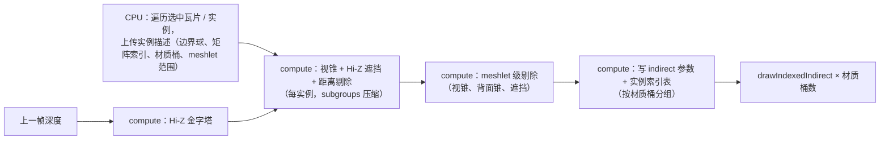

# 虚拟化与 GPU-driven（UE5 概念的落地评估）

## WebGPU 能力现状（2026-09）

| 能力 | 状态 | 对本项目的影响 |
| --- | --- | --- |
| Compute shader、storage buffer、indirect draw | 核心 | GPU-driven 剔除与 indirect 绘制可做 |
| `indirect-first-instance` | 可选 feature，主流桌面可用 | indirect 参数中 `firstInstance` 可用，便于按实例索引取数据；不可用时用额外 storage 索引表 |
| `subgroups` | 可选 feature，Chrome / Firefox 已发布 | 剔除、前缀和、直方图加速 |
| `shader-f16` | 可选 feature | 减少 LUT / 噪声 / FFT 带宽 |
| 32 位原子 | 核心 | 可见性缓冲的软光栅需要 64 位（深度 + ID 一次原子写入）；32 位只能做两遍（先 atomicMax 深度，再比对写 ID）或牺牲精度 |
| 64 位原子 min / max | 提案：规范 PR 已获 WGSL 编辑批准，CTS 已落地，浏览器尚未发布（见 [gpuweb#5071](https://github.com/gpuweb/gpuweb/issues/5071)） | Nanite 式软光栅的关键；落地后可一遍写 `vec2<u32>`（深度, ID） |
| Bindless（`GPUResourceTable`） | 草案，浏览器无预览（见 [gpuweb#5517](https://github.com/gpuweb/gpuweb/issues/5517)、[proposals/bindless.md](https://github.com/gpuweb/gpuweb/blob/main/proposals/bindless.md)） | 无法在一个 pass 中任意索引材质纹理；可见性缓冲的材质解析需要按材质分桶多 pass，或用大图集 / `texture_2d_array` |
| Mesh shader | 不在 WebGPU 内，被 bindless 阻塞 | 不能依赖；meshlet 走 compute + indirect |
| Ray tracing | 不在 WebGPU 内 | 不考虑 |
| `texture_2d_array` 层数 | 核心上限 256 | 虚拟纹理物理页池用少量大图集而非多层数组 |
| `maxStorageBufferBindingSize` | 核心 128 MB | meshlet 数据与顶点池可分块 |

结论：**GPU-driven 剔除 + indirect、虚拟纹理、Hi-Z 遮挡** 在今天的 WebGPU 上完全可行；**Nanite 式软光栅与可见性缓冲材质解析** 受 64 位原子与 bindless 限制，列为 R&D 轨道；**VSM** 可做但工作量大，作为 CSM 的后续。

## 决策

### 1. GPU-driven 渲染（M8 正式里程碑）

- 顶点 / 索引池：同一材质桶内的 Model 图元写入共享大 buffer（子分配器，按瓦片卸载释放），一次 `setVertexBuffer` 覆盖整个桶。
- 实例数据：storage 数组（相机相对矩阵、法线矩阵、要素表偏移），`instance_index`（或 indirect 表）索引。
- 材质桶：相同 pipeline + 相同 bind group 2 的图元归一桶；桶数决定 indirect 调用数（目标 < 100）。
- Hi-Z：上一帧 Reverse-Z 深度生成 min 金字塔（Reverse-Z 下用 min），遮挡测试用实例包围球屏幕矩形。
- 对 Globe 瓦片也适用：瓦片作为实例，边界体已存在。

### 2. 虚拟纹理（SVT，M8）

- 目标：影像图层（尤其多层叠加时）与大规模 3D Tiles 材质纹理。
- 结构：逻辑纹理按 128² 页切分（含 4 px 边界），间接表（page table）纹理每 mip 一层，物理页池 1–2 张 8192² `rgba8unorm`（或 BC 压缩）图集。
- 反馈：1/8 分辩率 feedback pass 输出（纹理 ID，页坐标，mip），compute 去重后异步读回，驱动页请求（复用 `RequestScheduler`）。
- 影像图层落地：`ImageryLayer` 的瓦片直接作为页（256 瓦片 = 4 页或页尺寸对齐瓦片尺寸），四叉树加载逻辑与页请求合一——这是与 Cesium 最大的结构差异，需要在 [06](06-globe-terrain-imagery.md) 的接口预留下推进。
- 优点：地形着色器只采样一次间接表 + 一次物理纹理，与影像层数无关；瓦片纹理驻留由页池统一管理。

### 3. Meshlet 与 Nanite-like（R&D 轨道）

分三步，每步都有独立价值：

1. **Meshlet 数据结构（可做）**：加载 glTF 时（Worker）用 meshoptimizer（WASM）生成 meshlet（64 顶点 / 124 三角形）、边界球、法线锥；渲染用 meshlet 级 compute 剔除 + indirect（上节）。收益：大模型剔除粒度细。
2. **Meshlet LOD DAG（可做，但离线为佳）**：Nanite 的簇合并 + 简化 + 分组，运行时按屏幕误差选簇；可作为 3D Tiles 之外的模型 LOD 方案。对 3D Tiles 而言，瓦片本身已是 LOD 层级，收益有限——只对单体大模型（如 BIM）有意义。**建议作为离线工具（tiler 端）而非运行时**。
3. **软光栅 + 可见性缓冲（阻塞）**：小三角形用 compute 软光栅写 `(depth, id)`，需要 64 位原子；材质解析需要 bindless 或按材质多 pass。待浏览器发布 64 位原子 min / max 后做原型；bindless 落地前用「材质桶多 pass」方案验证可行性。

### 4. 虚拟阴影贴图（VSM，M8 之后）

- 结构：每个方向光的 clipmap（16 级，每级 16k² 虚拟分辩率），页表 + 物理页池（`depth32float` 8192² 或多张 4096²）。
- 页分配：从主深度反投影每像素到光空间，标记所需页（compute），分配物理页，只渲染有需求且失效的页（相机 / 物体变化）。
- 渲染：每页一个视口的 indirect 绘制（借助 GPU-driven 剔除的输出，按页剔除实例）。
- 收益：全球尺度的清晰阴影（远处建筑也有），避免 CSM 的覆盖范围限制。
- 成本：实现复杂度高（页失效、缓存、静态 / 动态分离），列为长期项。

### 5. 其他 UE5 概念评估

| 概念 | 评估 |
| --- | --- |
| Lumen（软件 RT GI） | 需要 SDF / 卡片表面缓存 + 大量 compute；不适合流式全球场景；SSGI 是唯一可选 GI |
| World Partition / 流式加载 | Cesium 的四叉树 / 3D Tiles 已是流式方案，无需引入 |
| Large World Coordinates（f64） | 对应本项目的相机相对渲染 [05](05-scene-camera-precision.md) |
| Temporal Super Resolution | TAA 上采样变体，可在 TAA 基础上加 1.5× 上采样作为性能选项（M6 后） |
| Substrate 材质 | 不需要 |
| Niagara 粒子 | 天气粒子用简化 GPU 粒子系统 |

## 备选

- **等待 mesh shader / bindless 再做 GPU-driven**：会无限期推迟；今天的 compute + indirect 已能覆盖 80% 收益。
- **虚拟纹理只做 3D Tiles 材质，不做影像**：影像才是全球场景中纹理带宽与绑定切换的主要来源；两者都做，影像优先。

## 风险

- GPU-driven 与流式加载 / 卸载的内存管理（顶点池碎片、实例表压缩）是长期复杂度来源。
- 虚拟纹理反馈读回延迟（1–2 帧）导致快速缩放时页缺失，需要 mip 回退链（缺页时用更粗 mip）。
- 64 位原子与 bindless 的发布时间不受控；R&D 轨道不能进入承诺路线图。

## 待验证

- [ ] M8：Hi-Z 遮挡对城市级 3D Tiles 的绘制减少比例。
- [ ] M8：影像图层走虚拟纹理后与传统图集方案的画质（各向异性、边界）与性能对比。
- [ ] R&D：Chrome Canary 若发布 64 位原子（flag），用一个 100 万三角形模型做软光栅原型。
