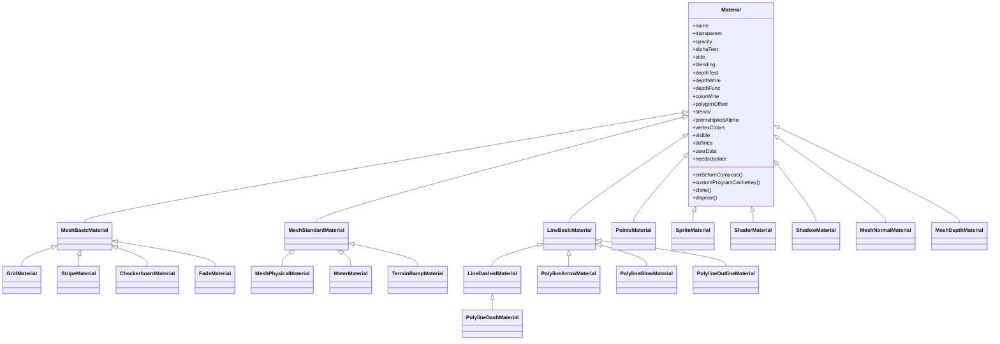
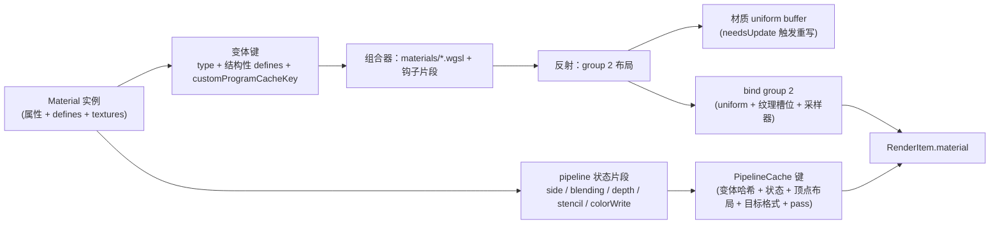

# 材质系统（参考 three.js）

对应 ADR-0010。Cesium 的 Fabric 材质 DSL（JSON 描述 + GLSL 拼接）与 Appearance 体系不移植；本项目以 three.js 的**经典属性式材质类层级**为参考重新设计，节点式材质（TSL 风格）作为后置 R&D。

## 决策

### 1. 覆盖范围

| 对象 | 使用方式 |
| --- | --- |
| 图元：`Primitive`、Polygon / Polyline / Wall / Corridor 等几何、`BillboardCollection`、`PointPrimitiveCollection`、`PolylineCollection` | 直接持有 `Material` 实例（对应 three.js `Mesh.material`） |
| glTF `Model` / 3D Tiles | 解析时把 glTF 材质映射为 `MeshPhysicalMaterial`（或 `MeshBasicMaterial` for unlit）；用户可通过 `model.material`、`tileset.materialOverride` 覆写或修改 |
| Globe 地表 | 保持专用地形着色器（影像合成，见 [06](06-globe-terrain-imagery.md)），不走 `Material`；高程色带 / 等高线 / 坡度等作为地表的可选「材质覆盖层」，复用 `TerrainRampMaterial` 的参数与 WGSL 模块 |
| 大气、云、海洋、后处理 | 效果 pass 自管着色器，不走 `Material` |

### 2. 类层级

#### 2.1 `Material` 基类（属性名沿用 three.js）

| 分组 | 属性 | 说明 |
| --- | --- | --- |
| 标识 | `id` `uuid` `name` `type` `userData` | — |
| 透明 | `transparent` `opacity` `alphaTest` `alphaToCoverage`（仅 MSAA 模式） `premultipliedAlpha` | `transparent === true` 进入前向透明 pass，否则写 G-buffer |
| 面 | `side`：`FrontSide` / `BackSide` / `DoubleSide` | → pipeline `cullMode`；`DoubleSide` 在 WGSL 中翻转背面法线 |
| 混合 | `blending`：`NoBlending` / `NormalBlending` / `AdditiveBlending` / `SubtractiveBlending` / `MultiplyBlending` / `CustomBlending`；`blendSrc` `blendDst` `blendEquation` `blendSrcAlpha` `blendDstAlpha` `blendEquationAlpha` `blendColor` `blendAlpha` | → `GPUBlendState`；常量映射到 `GPUBlendFactor` / `GPUBlendOperation` |
| 深度 | `depthTest` `depthWrite` `depthFunc`（`LessEqualDepth` 等 three.js 常量，语义上「更近通过」） | RHI 在 Reverse-Z 下把 `Less*` 映射为 `greater*`，用户无需关心 |
| 深度偏移 | `polygonOffset` `polygonOffsetFactor` `polygonOffsetUnits` | → `depthBias` / `depthBiasSlopeScale`，符号由 RHI 统一按 Reverse-Z 处理 |
| 模板 | `stencilWrite` `stencilFunc` `stencilRef` `stencilWriteMask` `stencilFuncMask` `stencilFail` `stencilZFail` `stencilZPass` | → `GPUDepthStencilState.stencilFront/Back`（分类与裁剪使用） |
| 颜色 | `colorWrite` `vertexColors` `toneMapped` `dithering` | `toneMapped=false` 用于 UI / 标签直出 |
| 阴影 | `shadowSide` | 阴影 pass 的 cull |
| 裁剪 | `clippingPlanes` `clipIntersection` `clipShadows` | 对齐 Cesium `ClippingPlaneCollection`，用 `clip-distances` feature 或片元 `discard` |
| 变体 | `defines`（键值 → 组合器 defines） `customProgramCacheKey()` | 参与 pipeline 缓存键 |
| 钩子 | `onBeforeCompose(shader, renderer)` | 对应 three.js `onBeforeCompile`：可读写 WGSL 模块源码、追加 uniform、插入固定接口点片段（`#import "material/hooks/*.wgsl"` 处） |
| 生命周期 | `needsUpdate` `version` `clone()` `copy()` `dispose()` `toJSON()` | `needsUpdate` 使变体键与 uniform 重建；`dispose()` 释放 bind group 与纹理引用计数 |

#### 2.2 网格材质

| 类 | 属性（在基类之上） | 用途 |
| --- | --- | --- |
| `MeshBasicMaterial` | `color` `map` `alphaMap` `aoMap` `aoMapIntensity` `lightMap` `envMap` `reflectivity` `combine` `wireframe` `wireframeLinewidth` `fog` | 无光照；unlit glTF、标注面、调试 |
| `MeshStandardMaterial` | `color` `roughness` `metalness` `map` `alphaMap` `aoMap` `emissive` `emissiveIntensity` `emissiveMap` `bumpMap` `bumpScale` `normalMap` `normalMapType` `normalScale` `displacementMap`（顶点位移，可选）`roughnessMap` `metalnessMap` `envMap` `envMapIntensity` `envMapRotation` `flatShading` `wireframe` `fog` | PBR 金属-粗糙度，写 G-buffer |
| `MeshPhysicalMaterial` | `clearcoat` `clearcoatMap` `clearcoatRoughness` `clearcoatRoughnessMap` `clearcoatNormalMap` `clearcoatNormalScale` `ior` `reflectivity` `specularIntensity` `specularIntensityMap` `specularColor` `specularColorMap` `sheen` `sheenColor` `sheenColorMap` `sheenRoughness` `sheenRoughnessMap` `transmission` `transmissionMap` `thickness` `thicknessMap` `attenuationDistance` `attenuationColor` `iridescence` `iridescenceIOR` `iridescenceMap` `iridescenceThicknessRange` `iridescenceThicknessMap` `anisotropy` `anisotropyRotation` `anisotropyMap` `dispersion` | 与 glTF `KHR_materials_*` 一一对应；`transmission > 0` 强制走前向透明 pass 并读取不透明颜色缓冲 |
| `MeshNormalMaterial` `MeshDepthMaterial` | — | 调试与阴影 / 深度 pass 内部使用 |
| `ShadowMaterial` | `color` | 只接收阴影的透明面（地面阴影承接） |

#### 2.3 线、点、精灵

| 类 | 属性 | 说明 |
| --- | --- | --- |
| `LineBasicMaterial` | `color` `linewidth` `linewidthUnits`（`"pixels"` 默认 / `"meters"`，GIS 扩展）`linecap` `linejoin` `vertexColors` `fog` | 折线用屏幕空间挤出（对齐 Cesium `PolylineCollection`），不是 GPU 原生 1 px 线 |
| `LineDashedMaterial` | `dashSize` `gapSize` `scale` `dashOffset` | 沿线距离在顶点阶段计算 |
| `PointsMaterial` | `color` `map` `alphaMap` `size` `sizeAttenuation` `outlineColor` `outlineWidth`（GIS 扩展，对齐 `PointPrimitive`）`disableDepthTestDistance`（GIS 扩展） | 点云与点图元 |
| `SpriteMaterial` | `color` `map` `alphaMap` `rotation` `sizeAttenuation` `alignedAxis`（GIS 扩展）`pixelOffset` `eyeOffset` `scaleByDistance` `translucencyByDistance` `disableDepthTestDistance`（GIS 扩展，对齐 `Billboard`） | Billboard / Label 图集渲染 |

#### 2.4 `ShaderMaterial`

- 属性：`vertexShader` `fragmentShader`（WGSL 模块源码字符串，可 `#import` 内置模块）`uniforms`（`{ name: { value } }`，类型由反射推断或显式声明）`defines` `lights`（是否注入光照 / 阴影 / 大气绑定）`fog` `wireframe` `glslVersion` 不存在（无 GLSL）。
- 契约：顶点入口输出 `VertexOutput`（含裁剪空间位置、世界 / 视图空间位置与法线、UV、颜色），片元入口输出 `MaterialOutput`（`baseColor` `normal` `roughness` `metalness` `emissive` `occlusion` `opacity` `materialId`），由渲染器决定写 G-buffer 还是前向着色；用户也可以选择 `rawOutput` 模式直接输出最终颜色（对应 three.js `RawShaderMaterial`）。
- 对应 Cesium `CustomShader`：模型管线的 `CustomShaderPipelineStage` 改为把 `Model.customShader` 表达为对当前 `MeshPhysicalMaterial` 的 `onBeforeCompose` 钩子或替换为 `ShaderMaterial`。

#### 2.5 GIS 扩展材质（替代 Cesium Fabric 内置材质）

| 类 | 对应 Cesium Fabric 类型 | 属性 |
| --- | --- | --- |
| `GridMaterial` | `Grid` | `color` `cellAlpha` `lineCount` `lineThickness` `lineOffset` |
| `StripeMaterial` | `Stripe` | `evenColor` `oddColor` `offset` `repeat` `orientation` |
| `CheckerboardMaterial` | `Checkerboard` | `lightColor` `darkColor` `repeat` |
| `FadeMaterial` | `Fade` | `fadeInColor` `fadeOutColor` `time` `maximumDistance` `repeat` `fadeDirection` |
| `WaterMaterial` | `Water` | `baseWaterColor` `blendColor` `specularMap` `normalMap` `frequency` `animationSpeed` `amplitude` `specularIntensity`；法线动画与海洋模块共享 |
| `TerrainRampMaterial` | `ElevationRamp` `ElevationContour` `ElevationBand` `SlopeRamp` `AspectRamp` | `mode` `ramp`（`Texture` 或颜色停靠点数组）`minimumHeight` `maximumHeight` `contourSpacing` `contourWidth` `contourColor`；地表覆盖层与 Primitive 共用 WGSL 模块 |
| `PolylineArrowMaterial` | `PolylineArrow` | `color` |
| `PolylineDashMaterial` | `PolylineDash` | `color` `gapColor` `dashLength` `dashPattern` |
| `PolylineGlowMaterial` | `PolylineGlow` | `color` `glowPower` `taperPower` |
| `PolylineOutlineMaterial` | `PolylineOutline` | `color` `outlineColor` `outlineWidth` |
| `Image` | `Image` | 直接用 `MeshBasicMaterial({ map })` + `Texture.repeat` |
| 自定义 Fabric | — | 用 `ShaderMaterial` 或子类化 |

### 3. `Texture` 对象（对齐 three.js）

| 类 | 说明 |
| --- | --- |
| `Texture` | `source`（`ImageBitmap` / `HTMLCanvasElement` / `VideoFrame` / typed array + 尺寸）`wrapS` `wrapT`（`RepeatWrapping` / `ClampToEdgeWrapping` / `MirroredRepeatWrapping`）`magFilter` `minFilter`（含 mipmap 变体）`anisotropy` `format`（`GPUTextureFormat`）`colorSpace`（`SRGBColorSpace` → `-srgb` 格式；`LinearSRGBColorSpace` / `NoColorSpace`）`offset` `repeat` `rotation` `center` `matrixAutoUpdate` `matrix`（→ `uvTransform` 3×3 传入 uniform）`flipY`（默认 `false`，与 WebGPU 一致；three.js 默认 `true`，文档注明差异）`generateMipmaps`（compute 生成）`premultiplyAlpha` `needsUpdate` `version` `dispose()` |
| `CubeTexture` | 6 面；IBL 环境图 |
| `DataTexture` `Data3DTexture` `DataArrayTexture` | typed array 输入；LUT、噪声、要素表 |
| `CompressedTexture` `CompressedArrayTexture` | KTX2 转码结果，按 `device.features` 选 BC / ETC2 / ASTC |
| `VideoTexture` | `VideoFrame` 每帧上传 |
| `CanvasTexture` | 文字标签、动态图 |
| `DepthTexture` | 渲染器内部使用；用户可在 `ShaderMaterial` 中读场景深度 |

- RHI 层按 `Texture` 的 `uuid + version` 缓存 `GPUTexture`，按采样参数缓存 `GPUSampler`（`SamplerCache`）。
- 纹理引用计数：材质 `dispose()` 减引用，归零时销毁 GPU 资源；`Texture` 可被多材质共享。

### 4. 与渲染器的映射

- **结构性开关**（有无 `map` / `normalMap` / `emissiveMap` 等纹理、`vertexColors`、`flatShading`、蒙皮、变形、实例化、`DoubleSide`、`alphaTest > 0`、`transmission > 0`）进入 defines 与变体键；**数值**（颜色、粗糙度、`uvTransform`、`opacity`）只进 uniform，不产生变体。
- 纹理槽位固定（见 [07](07-3dtiles-and-model.md)）：缺失纹理绑定 1×1 默认纹理并用 defines 跳过采样代码；两者并存的原因是 WebGPU 要求 bind group 完整，而跳过采样能省带宽。
- **pass 归属**：`transparent || opacity < 1 || blending !== NormalBlending || transmission > 0` → 前向透明 pass（排序 / WBOIT）；否则 G-buffer pass；`ShadowMaterial` 与 `depthWrite=false` 的特殊材质按需。阴影 pass 使用材质的 `alphaTest` / `alphaMap` 生成 `MeshDepthMaterial` 变体。
- **实例数据**（模型矩阵、要素 ID、样式颜色）不属于材质，走 group 3，因此同一材质可被上千 RenderItem 共享。
- **`onBeforeCompose` 接口点**：`vertex_position`（位移）、`vertex_output`（额外 varying）、`material_baseColor`、`material_normal`、`material_roughnessMetalness`、`material_emissive`、`material_output`（最终 `MaterialOutput`）。Model 管线阶段与用户钩子使用相同接口点，阶段先于用户钩子执行。

### 5. glTF → 材质映射

| glTF | 材质属性 |
| --- | --- |
| `pbrMetallicRoughness.baseColorFactor/Texture` | `MeshPhysicalMaterial.color` / `map`（`-srgb`）+ `opacity` |
| `metallicFactor` `roughnessFactor` `metallicRoughnessTexture` | `metalness` `roughness` `metalnessMap` = `roughnessMap`（同一纹理，B / G 通道约定） |
| `normalTexture` + `scale` | `normalMap` `normalScale` |
| `occlusionTexture` + `strength` | `aoMap` `aoMapIntensity` |
| `emissiveFactor` `emissiveTexture` `KHR_materials_emissive_strength` | `emissive` `emissiveMap` `emissiveIntensity` |
| `alphaMode` `alphaCutoff` `doubleSided` | `OPAQUE` → 默认；`MASK` → `alphaTest`；`BLEND` → `transparent = true`；`doubleSided` → `DoubleSide` |
| `KHR_materials_unlit` | `MeshBasicMaterial` |
| `KHR_materials_clearcoat` `ior` `specular` `sheen` `transmission` `volume` `iridescence` `anisotropy` `dispersion` | `MeshPhysicalMaterial` 对应属性 |
| `KHR_materials_pbrSpecularGlossiness`（已废弃） | 转换为 metallic-roughness 近似 |
| `KHR_texture_transform` | `Texture.offset / repeat / rotation / center` |
| `KHR_texture_basisu` `EXT_texture_webp` | `CompressedTexture` / 解码后 `Texture` |
| `sampler`（wrap / filter） | `Texture.wrapS/T`、`magFilter/minFilter` |
| `EXT_mesh_features` / 样式颜色 / `show` | 不进材质；走要素表（group 3） |

- 同一 glTF 内相同材质定义共享一个实例；`ResourceCache` 缓存材质与纹理。
- 覆写：`model.material = new MeshBasicMaterial(...)`（全部图元），`model.getNode(...).primitives[i].material`（单图元），`tileset.materialOverride = (primitiveInfo) => Material | undefined`（按瓦片 / 图元回调）。覆写后原材质保留，可 `model.material = undefined` 恢复。

### 6. 节点式材质（后置 R&D）

- 目标：类似 three.js `NodeMaterial` / TSL，用 JS 节点图描述材质并生成 WGSL，服务可视化材质编辑器。
- 约束：节点图输出必须落到与经典材质相同的 `MaterialOutput` 契约与 group 2 布局，从而可与经典材质在同一 pass 混用。
- 前置：经典材质在 M9 稳定、`onBeforeCompose` 接口点被验证够用之后再立 ADR；不承诺时间。

## 备选

- **移植 Cesium Fabric + Appearance**：JSON 描述 + GLSL 字符串拼接，难类型化、难反射、视觉效果上限低（无 PBR 扩展、无清漆 / 透射）；用户明确要求换。否决。
- **直接采用 TSL 节点式**：表达力强，但实现节点编译器成本高，且 ADR-0003 已否决在首期做节点图；作为后置 R&D。
- **不提供材质类，只有参数对象**：API 不直观、扩展困难；three.js 的类层级已被广泛接受。否决。
- **完全照搬 three.js 属性语义（含 `flipY=true`、`linewidth` 仅像素）**：与 WebGPU 与 GIS 场景不符；在个别属性上有意偏离并在文档标注。

## 风险

- pipeline 变体膨胀：材质类型 × 结构性 defines × 顶点布局 × pass。缓解：数值不进变体；顶点布局标准化；性能面板监控 pipeline 数；`createRenderPipelineAsync` 预热。
- three.js 用户的心智模型与 GIS 单位（米 vs 像素、高低位 RTE）冲突；`linewidthUnits` 等扩展需要文档。
- `MeshPhysicalMaterial.transmission` 需要读取不透明颜色缓冲，前向透明 pass 与 SSR / 云合成顺序耦合。
- `onBeforeCompose` 让用户接触 WGSL 内部接口点，接口点一旦公开就难以变更；首期标 `@experimental`。
- 材质 `dispose()` 与纹理共享的引用计数错误会导致 GPU 资源泄漏或提前销毁；需要开发模式的泄漏检查。

## 待验证

- [x] M4：材质 group 2 手写 80 字节整块重写（2026-09-13），**不上 `wgsl_reflect`**。`onBeforeCompose` 七个 `HOOK_*` 接口点已留。每网格每帧 `writeBuffer` 80 + 80 字节，20 个材质球可忽略。
- [ ] M5：glTF Sample Assets 全量映射到 `MeshPhysicalMaterial` 的视觉对比（与 three.js WebGPURenderer 截图对照）。
- [ ] M5：默认纹理 + defines 跳过采样 vs 纯 defines 的 pipeline 数与带宽对比。
- [ ] M9：`LineBasicMaterial` 屏幕空间挤出在 Reverse-Z 与 RTE 下的接缝与抗锯齿；`SpriteMaterial` 对齐 Billboard 全部选项后的性能。
- [ ] M9：`onBeforeCompose` 七个接口点是否足以表达 Cesium `CustomShader` 的全部示例。
