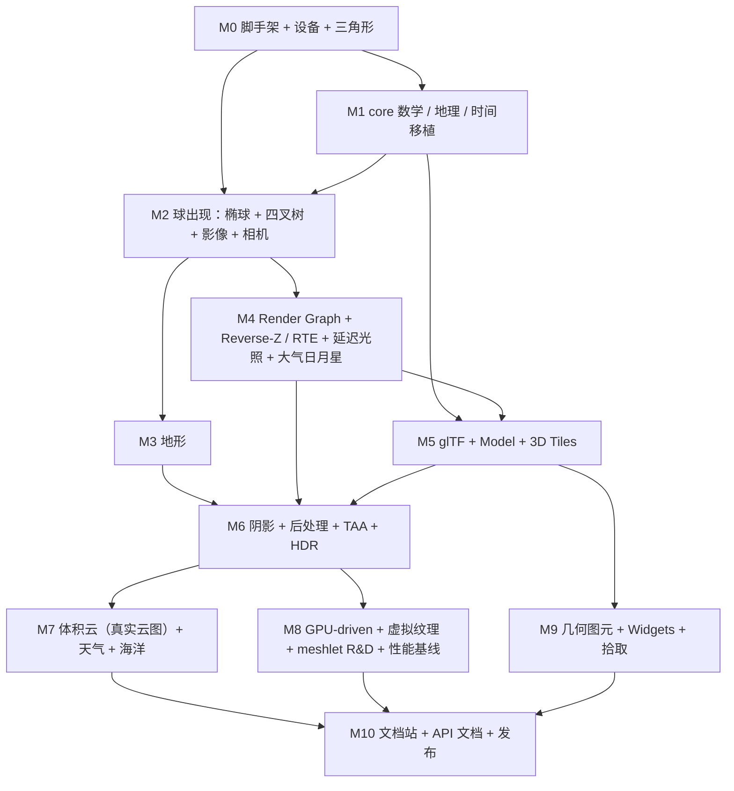

# 里程碑路线图

原则：每个里程碑都有可在示例站打开并截图的验收场景；先出球，再加地形，再加光影与效果；每个里程碑结束时回写 [50-progress/PROGRESS.md](../50-progress/PROGRESS.md) 与相关架构文档的「待验证」。

## 依赖关系

M3 与 M4 可并行；M5 依赖 M4 的 RenderItem / 材质接口稳定；M7 / M8 / M9 相互独立。

---

## M0 脚手架、WebGPU 设备、三角形

- **目标**：仓库可构建、可测试、可跑示例；`GpuDevice` 初始化；示例站显示一个清屏 + 三角形。
- **范围**：pnpm workspace、`core` / `rhi` / `shaders` / `renderer` / `scene` / `widgets` 空包骨架、tsdown 构建、Vitest（Node + 浏览器模式）、ESLint / Prettier / Husky、Vite + Vue 3 示例站骨架（示例列表 + canvas）、`?wgsl` 插件、组合器最小子集（`#import` / `#if`）、`GpuDevice.create()` 与 feature 探测、最小 Render Graph（一个 pass）、`PipelineCache`。
- **不做**：任何数学移植、相机、地球。
- **验收**：`pnpm build && pnpm test` 通过；示例站「Hello Triangle」在 Chrome 显示；`GpuDeviceSpec` 在无 WebGPU 环境 skip 而非失败；Playwright 截图一张。
- **风险**：工具链版本兼容（tsdown + Vitest 浏览器模式 + Worker）；WGSL 插件 HMR。

## M1 core 数学、地理、时间移植

- **状态**：完成（2026-09-13，已合并 `main`，PR #2）。清单与偏离见 [50-progress/PROGRESS.md](../50-progress/PROGRESS.md)。
- **目标**：`@webgpu-cesium/core` 覆盖 Cesium `Core` 中的数学 / 地理 / 时间 / 请求 / 事件模块，测试从 Cesium Specs 移植。
- **范围**：见 [02-cesium-module-inventory.md](02-cesium-module-inventory.md) 的「M1」列：`Math`、`Cartesian2/3/4`、`Cartographic`、`Matrix2/3/4`、`Quaternion`、`Ellipsoid`、`EllipsoidGeodesic`、`EllipsoidRhumbLine`、`EllipsoidTangentPlane`、`Rectangle`、`BoundingSphere`、`OrientedBoundingBox`、`AxisAlignedBoundingBox`、`BoundingRectangle`、`Plane`、`Ray`、`IntersectionTests`、`Intersections2D`、`CullingVolume`、`PerspectiveFrustum` / `OrthographicFrustum` 系列（改 0..1 深度 + Reverse-Z）、`Transforms`、`HeadingPitchRoll`、`HeadingPitchRange`、`EncodedCartesian3`、`GeographicProjection`、`WebMercatorProjection`、`GeographicTilingScheme`、`WebMercatorTilingScheme`、`JulianDate`、`GregorianDate`、`LeapSecond`、`TimeInterval(Collection)`、`TimeStandard`、`TimeConstants`、`Iso8601`、`Clock`、`ClockRange`、`ClockStep`、`Simon1994PlanetaryPositions`、`Iau2006XysData`、`EarthOrientationParameters`、`Event`、`EventHelper`、`defined`、`Check`、`DeveloperError`、`RuntimeError`、`destroyObject`、`Resource`、`Request`、`RequestScheduler`、`RequestType`、`TaskProcessor`、`Credit`、`Color`、`Occluder`、`EllipsoidalOccluder`、`AttributeCompression`、`ComponentDatatype`、`IndexDatatype`、`PrimitiveType`、`Heap`、`DoublyLinkedList`、`Queue`、`AssociativeArray`、`ManagedArray`、`binarySearch`、`mergeSort`。
- **不做**：几何生成（`*Geometry`，M9）、Provider（M2 / M3）。
- **验收**：移植的 Spec 全部通过；`core` 无 DOM 引用（Node 下运行）；tsc strict 零错误；包体 < 150 KB gzip。
- **风险**：Cesium 的 `result` 参数模式与 TS strict 的空值处理；`Resource` 的 `Image` 加载需要注入。

## M2 球出现

- **状态**：完成（2026-09-13，分支 `feat/m2-first-globe`，未合并 `main`）。清单与偏离见 [50-progress/PROGRESS.md](../50-progress/PROGRESS.md)。
- **目标**：示例站看到带影像的地球，可旋转 / 缩放 / 倾斜，缩放到街区级别不抖动。
- **范围**：`Scene`、`FrameState`、`Camera`（Reverse-Z 投影、相机相对视图矩阵）、`ScreenSpaceCameraController`（3D 分支）、`Globe`、`QuadtreePrimitive` 系列、`GlobeSurfaceTile`（无地形状态）、`EllipsoidTerrainProvider` + `HeightmapTessellator`（零高度）Worker、`ImageryLayer(Collection)`、`Imagery`、`TileImagery`、`ImageryProvider` 基类、`UrlTemplateImageryProvider`、`OpenStreetMapImageryProvider`、`TileMapServiceImageryProvider`、影像图集（`texture_2d_array`）、地形着色器（前向 Lambert）、`SkyBox` 占位（纯色）、帧级 uniform、性能面板（CPU 帧时间、瓦片数）。
- **不做**：地形高程、大气、光照模型、G-buffer、拾取。
- **验收**：OSM 影像地球；从太空到 100 m 高度连续缩放无抖动、无缝、无黑瓦片；相机控制手感与 Cesium 一致（录制输入序列对比相机姿态误差 < 1e-6 相对）；1080p CPU 帧时间 < 4 ms；Playwright 三张基线截图（太空、国家级、城市级）。
- **风险**：四叉树移植的行为偏差；图集 layer 上限；Web Mercator 重投影。

## M3 地形

- **目标**：Cesium 世界地形（quantized-mesh）与自定义高度图可加载，含法线、裙边、填充网格、垂直夸张、地形拾取。
- **范围**：`CesiumTerrainProvider`、`QuantizedMeshTerrainData`、`HeightmapTerrainData`、`TerrainEncoding` / `TerrainQuantization` / `TerrainMesh`、`createVerticesFromQuantizedTerrainMesh` / `upsampleQuantizedTerrainMesh` / `createVerticesFromHeightmap` Worker、`TerrainFillMesh`、`TileAvailability`、`ApproximateTerrainHeights`、`VerticalExaggeration`、`Globe.pick` / `getHeight`、`sampleTerrain(MostDetailed)`、`CustomHeightmapTerrainProvider`、`ArcGISTiledElevationTerrainProvider`、`Cesium3DTilesTerrainProvider`（若时间允许）、水面掩码输入、相机地形碰撞。
- **不做**：地形光照升级（M4 之后由 G-buffer 处理）；海洋。
- **验收**：ion 世界地形 + 影像在山区截图；瓦片切换无缝；`sampleTerrain` 数值与 Cesium 一致（同一坐标误差 < 1 cm）；相机不穿地。
- **风险**：Worker 上传延迟；Reverse-Z 下裙边与填充网格接缝。

## M4 Render Graph、Reverse-Z / RTE 落地、延迟光照、大气与天体

- **目标**：完整帧图；G-buffer + 延迟光照；Hillaire 大气；太阳 / 月亮 / 星空由时间驱动；空气透视替代雾。
- **范围**：Render Graph 完整实现（编译、别名、调试导出）、G-buffer 布局、`FrameUniforms` 定型、PBR 光照函数、IBL（天空生成）、Hillaire 四 LUT compute、天空 pass、日盘 / 月盘 / 星表、`SunLight` / `DirectionalLight`、`EnvironmentState`、自动曝光（简版）、Reinhard / ACES 色调映射（简版，完整版 M6）、地形写 G-buffer、高低位 RTE 模块（为 M9 图元准备）、**材质系统基础**：`Material` / `Texture` 基类、`MeshBasicMaterial`、`MeshStandardMaterial`、`MeshPhysicalMaterial`（供 M5 glTF 映射）、`MaterialOutput` 契约、group 2 反射布局、`onBeforeCompose` 接口点、一个测试用球体 / 立方体图元验证材质。
- **不做**：阴影、TAA、Bloom、云、线 / 点 / 精灵 / Shader 材质。
- **验收**：地球在不同时间（正午 / 日落 / 夜晚）截图，与 Cesium `SkyAtmosphere` 对比差异有据；从地表飞到 400 km 无能量跳变；月相与真实日期一致（对比天文年历）；帧图导出 Mermaid；材质球示例（金属 / 粗糙度 / 清漆网格）截图。
- **风险**：LUT 成本；曝光映射；能量连续性。

## M5 glTF、Model、3D Tiles

- **目标**：glTF 2.0 全量加载与渲染；3D Tiles 1.0 / 1.1 数据集（含隐式瓦片、元数据、样式）在延迟管线中渲染。
- **范围**：`GltfPipeline/*`、`GltfLoader` 系列、`ResourceCache`、`ModelComponents`、`ModelSceneGraph`、管线阶段（重写为数据准备）、glTF 材质 → `MeshPhysicalMaterial` / `MeshBasicMaterial` 映射（全部 `KHR_materials_*`）、`model.material` 与 `tileset.materialOverride` 覆写钩子、`CompressedTexture`（KTX2）、蒙皮 / 变形 / 动画、实例化、Draco / KTX2 / meshopt Worker、`Cesium3DTileset` 系列、遍历、缓存、隐式瓦片、元数据、样式、要素、`B3dm / I3dm / Pnts / Composite` 内容、点云着色、`createGooglePhotorealistic3DTileset`、`IonResource`、Model 拾取 pass 与要素拾取（异步）。
- **不做**：分类、裁剪平面 / 多边形、`ModelImagery`、矢量瓦片、高斯泼溅、I3S、ITwin。
- **验收**：glTF Sample Assets 全量截图（与 three.js WebGPURenderer 参考渲染对比）；城市级 3D Tiles（如 Cesium ion OSM Buildings 与 Google Photorealistic）流式加载 60 fps；样式表达式示例；要素拾取示例；材质覆写示例（把建筑替换为 `MeshBasicMaterial` 线框 / 玻璃 `MeshPhysicalMaterial`）。
- **风险**：移植量最大（约 150 文件）；材质变体；透明排序。

## M6 阴影、后处理、TAA、HDR

- **目标**：画面达到「宣传级」的基线：CSM、TAA、Bloom、GTAO、完整色调映射、HDR 输出。
- **范围**：CSM（稳定级联、PCF / PCSS）、`ShadowSettings`、GTAO、TAA（运动向量、历史裁剪）、Bloom、自动曝光直方图、ACES / AgX、颜色分级 LUT、可选 SSR、WBOIT、后处理阶段 API（用户 WGSL 阶段）、HDR canvas 探测与输出、质量预设。
- **不做**：VSM、SSGI、景深。
- **验收**：城市 3D Tiles + 地形 + 大气在日落时的截图；TAA 静止无闪烁、运动无明显鬼影；HDR 显示器上 HDR 输出可见差异；1080p 高预设在 RTX 3060 级 GPU 上 60 fps。
- **风险**：G-buffer 带宽；TAA 与瓦片 LOD 切换。

## M7 体积云（真实云图）、天气、海洋

- **目标**：全球体积云由真实卫星云图驱动；雨雪雾闪电；FFT 海洋。
- **范围**：`WeatherMapProvider` 接口 + GIBS 实现 + 离线默认图、Worker 预处理、Perlin-Worley / 细节噪声生成（compute，启动时）、STBN、云 ray-march（1/4 分辩率 + 分帧 + 重投影）、云阴影图、云与大气 / 深度合成、质量预设、`WeatherSystem` 与 `WeatherState`、GPU 粒子（雨 / 雪）、地表湿润、高度雾、闪电、风参数、FFT 海洋（频谱、演化、IFFT、级联）、水面掩码接入、海洋着色（反射 / 折射 / 泡沫）。
- **不做**：froxel 体积雾 / 体积光；实时静止卫星源（若无现成 CORS 源）。
- **验收**：真实日期的全球云分布截图与卫星图对照；近地云层截图；雨 / 雪 / 雾 / 闪电示例；海岸线海洋示例；中端笔记本 `medium` 预设 60 fps。
- **风险**：云成本；数据源可用性；云 / 透明 / 粒子合成顺序。

## M8 GPU-driven、虚拟纹理、meshlet R&D、性能基线

- **目标**：城市级 3D Tiles 的 CPU 提交开销降低一个量级；影像图层走虚拟纹理；建立性能回归基线。
- **范围**：实例描述上传、compute 视锥 / Hi-Z 遮挡剔除、材质桶与 indirect、顶点池子分配、`indirect-first-instance` 回退路径、Hi-Z 金字塔、虚拟纹理（页表、物理页池、反馈 pass、页请求与 `ImageryLayer` 融合）、meshlet 生成（meshoptimizer WASM，Worker）与 meshlet 级剔除、timestamp-query 性能面板完整版、CI 性能基线（自托管 GPU runner 或本地脚本）。
- **不做**：软光栅 / 可见性缓冲（等 64 位原子）；VSM（后置）；meshlet LOD DAG 运行时。
- **验收**：同一城市场景绘制调用数 / CPU 时间对比 M6；虚拟纹理下 8 层影像叠加帧时间与 M6 图集方案对比；Hi-Z 剔除比例统计。
- **风险**：内存管理复杂度；反馈延迟。

## M9 几何图元、Widgets、拾取完善

- **目标**：Cesium 常用图元与 Viewer 级 UI。
- **范围**：`PolylineCollection`、`PolygonGeometry` 系列（`GeometryPipeline`、`PolygonPipeline`、`earcut`、Worker `createPolygonGeometry` 等）、`GroundPolyline` / 贴地多边形（深度技巧，Reverse-Z 标定）、`BillboardCollection`、`LabelCollection`（SDF 字体或 canvas 图集）、`PointPrimitiveCollection`、`Primitive` 通用几何 + `Material`、**材质系统补全**：`LineBasicMaterial` / `LineDashedMaterial` / `PointsMaterial` / `SpriteMaterial` / `ShaderMaterial` / `ShadowMaterial` 与 GIS 扩展材质（`Grid` `Stripe` `Checkerboard` `Fade` `Water` `TerrainRamp` `PolylineArrow / Dash / Glow / Outline`）、`VideoTexture` / `CanvasTexture`、高低位 RTE 顶点路径、`pick` / `pickPosition` / `drillPick` API 定型、`<CesiumViewer>`、时间轴、动画控件、图层选择器、导航帮助、全屏、性能面板组件、`Credit` 展示。
- **不做**：Entity / DataSources；CZML / GeoJSON / KML 实体层。
- **验收**：图元示例集（线、面、贴地、广告牌、标签、点）；材质示例集（对标 Cesium Sandcastle「Materials」示例的全部 Fabric 类型 + `ShaderMaterial` + `onBeforeCompose`）；Viewer 示例；拾取示例（含异步 API 演示）。
- **风险**：贴地几何在 Reverse-Z 下的实现；SDF 文字质量；材质变体数。

## M10 文档站、API 文档、发布

- **目标**：可对外发布的 0.x 版本。
- **范围**：VitePress 站（设计文档 + 教程 + 示例嵌入 + TypeDoc API）、README、`LICENSE` / `NOTICE`、Changesets 发布流程、npm 发布、CDN 聚合包、迁移指南（从 Cesium 到本项目的 API 差异表）、贡献指南。
- **验收**：`npm i @webgpu-cesium/webgpu-cesium` 五行代码出球；文档站部署；所有示例在文档站可运行。

---

## 里程碑之外的持续项

- 每个里程碑结束：性能回归、截图回归、更新「待验证」、更新移植清单状态、`LOG.md`。
- 跟踪 WebGPU 规范：64 位原子、bindless、mesh shader 的发布状态（[20-tech-stack/02](../20-tech-stack/02-webgpu-capability-matrix.md)）。
- 同步 Cesium 上游：地形 / 影像 / 3D Tiles 解析层的 bug 修复与新扩展（对照 `CHANGES.md`）按需移植。
